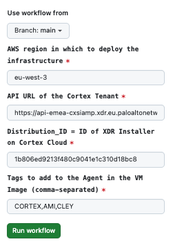
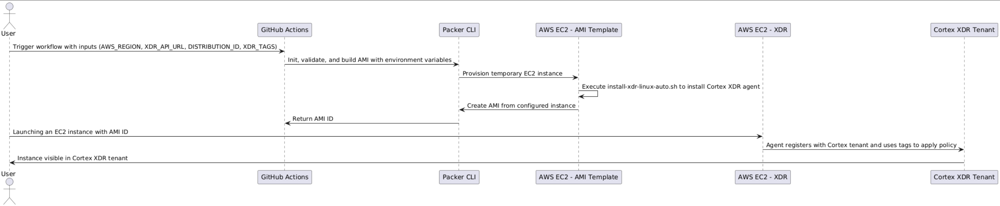
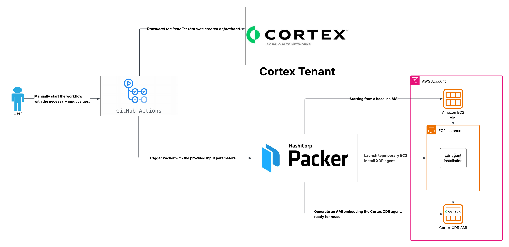
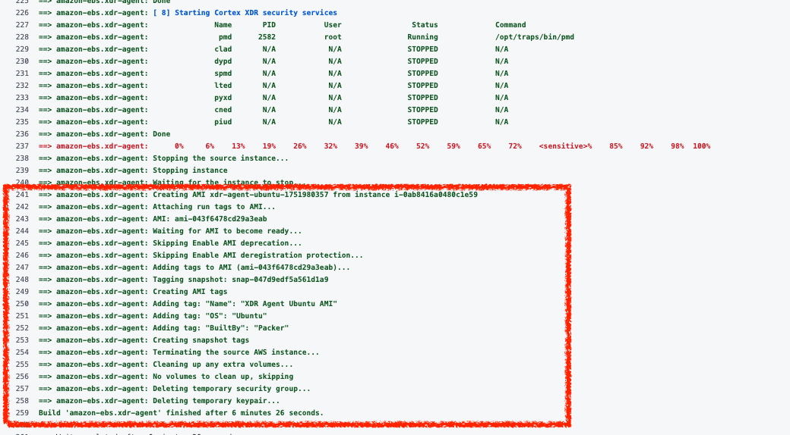
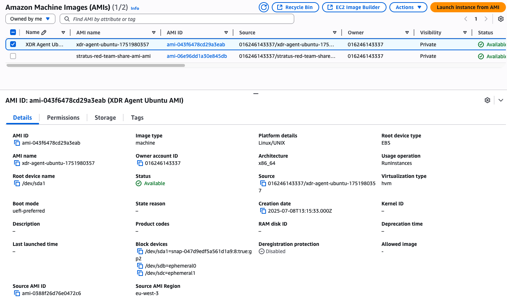
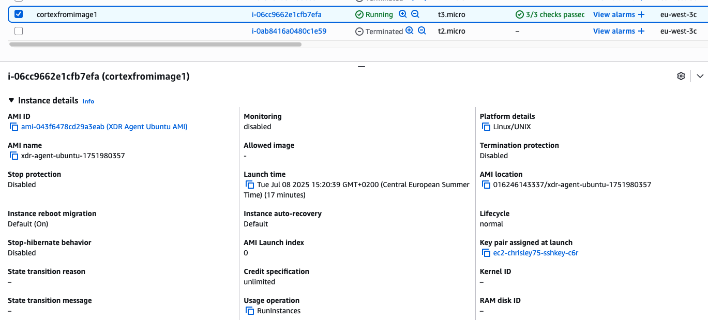
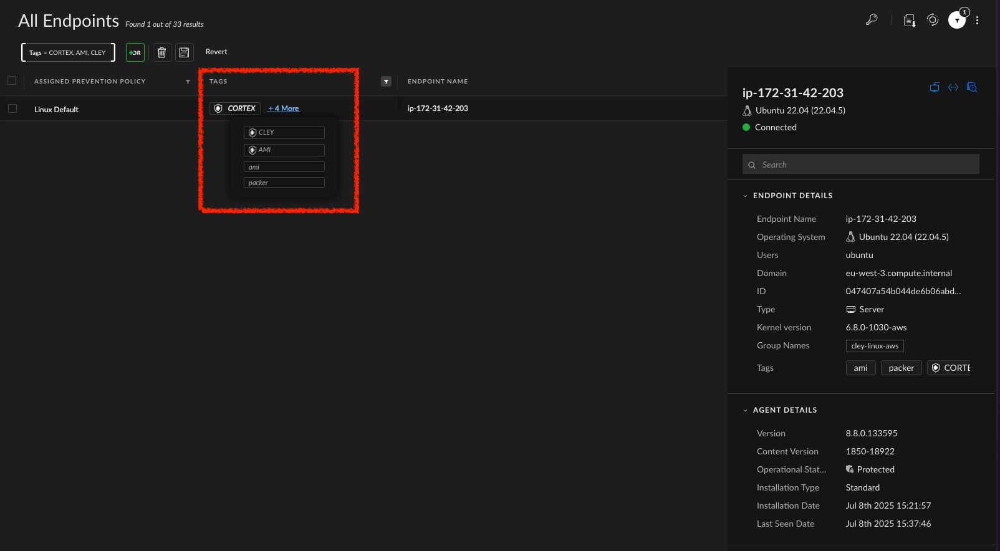

# Automated Build of Cortex XDR-enabled AMI with GitHub Actions & Packer

This repository automates the creation of an **Amazon Machine Image (AMI)** based on Ubuntu, pre-installed with the **Cortex XDR agent**, using a **GitHub Actions** pipeline that orchestrates **Packer** builds.

---

## 🚀 Overview

1. A user manually triggers the GitHub Actions workflow (`workflow_dispatch`).
2. GitHub Actions sets up AWS credentials and installs Packer.
3. Packer uses a template (`AMI-XDR-template.pkr.hcl`) to provision a temporary EC2 instance.
4. On the instance, a script installs and configures the Cortex XDR agent.
5. Packer creates a new AMI from this instance.
6. Any EC2 instance launched from this AMI will automatically register with the Cortex tenant, tagged accordingly.

---

## 📂 Repository Structure
```
├── packer-templates/
│ └── AMI-XDR-template.pkr.hcl # Packer HCL template
├── scripts/
│ └── install-xdr-linux-auto.sh # Cortex XDR agent install script
├── .github/
│ └── workflows/
│ └── build-ami.yml # GitHub Action workflow
└── README.md 
```

---

## 🔧 Pipeline Inputs

The workflow is manually triggered from the GitHub interface, prompting the user to provide input parameters.
Navigate to: `Actions > Use Packer to generate a Cortex XDR-enabled AMI. > Run Workflow`.


---

| Name              | Description                                | Required | Default Value (to override)                            |
| ----------------- | ------------------------------------------ | -------- | ------------------------------------------------------ |
| `AWS_REGION`      | AWS region where the AMI will be built     | Yes      | `eu-west-3` (Paris)                                    |
| `XDR_API_URL`     | Cortex Tenant API URL                      | Yes      | `https://api-emea-cxsiamp.xdr.eu.paloaltonetworks.com` |
| `DISTRIBUTION_ID` | Cortex XDR Agent Installer Distribution ID | Yes      | `1b806ed9213f480c9041e1c310d18bc8`                     |
| `XDR_TAGS`        | Comma-separated tags to apply on the agent | Yes      | `CORTEX,AMI,CLEY`                                      |

---

## 🔐 Required GitHub Secrets

Secrets in GitHub are used to securely store sensitive information, such as API keys or credentials, for use in GitHub Actions. 
They can be configured by navigating to: `Repository > Settings > Secrets and variables > Actions`.

- `AWS_ACCESS_KEY_ID` : AWS Access Key ID
- `AWS_SECRET_ACCESS_KEY` : AWS Secret Access Key
- `CORTEX_AUTH_ID` : Cortex API Authentication ID
- `CORTEX_AUTH_TOKEN` : Cortex API Authentication Token

---

## 🔄 Sequence Diagram (PlantUML)

---

## 🧱 Architecture Diagram

---

## 📦 Packer Template Highlights

- Base AMI: `Ubuntu 22.04 LTS (ami-0388f26d76e0472c6 in eu-west-3)`
- Instance type: `t2.micro`
- Script uploaded and executed: `install-xdr-linux-auto.sh`
- Script parameters passed:

```bash
bash install-xdr-linux-auto.sh '<xdr_url>' '<distribution_id>' '<auth_id>' '<auth_token>' '<xdr_tags>'
```
---
## 🏃 How to Run
1. Go to GitHub repository Actions tab.
2. Select the workflow: Use Packer to generate a Cortex XDR-enabled AMI.
3. Click Run workflow.
4. Fill in the inputs (or accept defaults).
5. Start the workflow.

Once complete, find the created AMI ID in the workflow logs or directly in the AWS EC2 AMIs console.

---
## 🎯 Expected Outcome
A reusable Ubuntu AMI with Cortex XDR Agent pre-installed.

EC2 instances launched with this AMI will auto-register in Cortex XDR tenant with specified tags and policies.

---
## Appendix

---

---

---

---